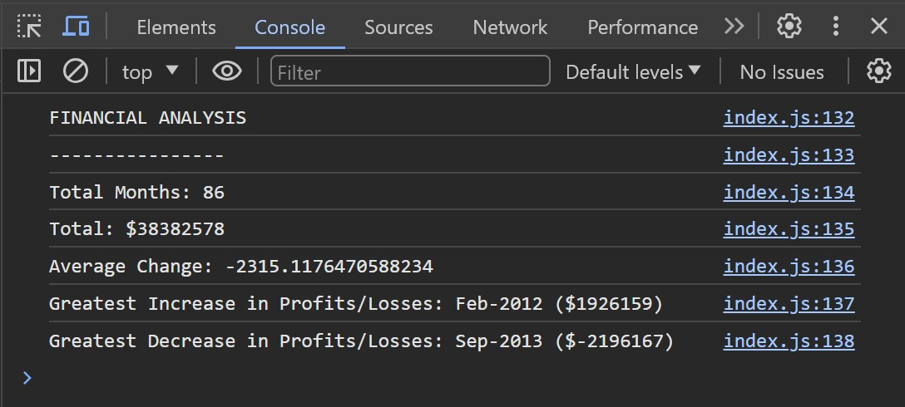

# Financial Analysis

## Description
This project is a JavaScript application that performs financial analysis on a series of months. It calculates and displays the total number of months, the net total of profit/losses, and the average change in profit/losses over the period. The code also identifies the month with the greatest increase and the month with the greatest decrease in profit/losses.

## Usage
To use this application the user will have to right-click anywhere on the webpage and selecting **Inspect**.

On the inspect panel click, the suer will need to click on the **Console** window to view the output of the code.

You can visit the website by clicking on this [LINK](https://cntervisi.github.io/Console-Finances/).

Here is a screenshot of the console output:

## License
This project is licensed under the MIT License. See the [license](./LICENSE) file for more details.